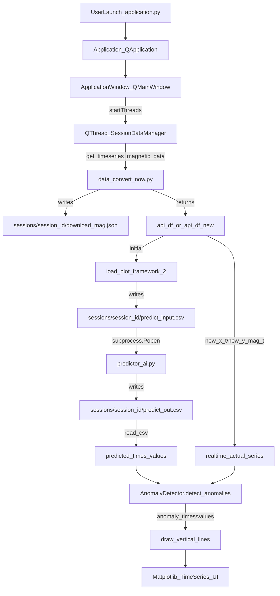

## Magnavis — System Summary (End-to-End)

This document summarizes the **exact working** of the Magnavis application centered around `src/application.py`, and how it collaborates with:

- `src/data_convert_now.py` (real-time magnetic field ingestion from USGS)
- `src/application_temp.py` (DB-based multi-sensor variant; see **DB / Temp variant** below)
- `src/data_convert_db_now.py` (DB-based time-series fetch for temp variant)
- `src/predictor_ai.py` (recurrent-model predictor subprocess; uses **GRU** in the current implementation)
- `src/Anomaly_detector.py` (statistical anomaly detection, with optional threshold freeze window)
- `src/ui_files/ui_ApplicationWindow.ui` and `src/ui_files/ui_MagneticTimeSeriesWidget.ui` (Qt UI definitions)

---

## Purpose (what the project does)

Magnavis is a **PyQt5 desktop application** for:

- Visualizing magnetic-field related data in:
  - **2D plots** (time series + map)
  - **3D view** (VTK-based spatial visualization for uploaded CSV tracks/points)
- Fetching **real-time magnetic field time series** (USGS GeoMag endpoint)
- Running **future predictions** via an LSTM model (in a separate process)
- Detecting **anomalies** by comparing predicted vs real-time measured values and highlighting them in the plots

---

## High-level module responsibilities

### `src/application.py` (the orchestrator)

- Builds and runs the **Qt application** (`class Application(QApplication)`) and main window (`class ApplicationWindow(...)`).
- Loads `.ui` files using `uic.loadUiType(...)`.
- Manages:
  - Data fetch threads (Qt `QThread` + worker `QObject`)
  - Plot setup and periodic updates (Matplotlib timers)
  - VTK rendering pipeline for spatial visualization
  - Session folder creation and file outputs
  - Prediction subprocess lifecycle (`subprocess.Popen`)
  - Anomaly detection calls + anomaly visualization

### `src/data_convert_now.py` (real-time ingestion)

- Downloads magnetic field data from USGS GeoMag Web Service (element `H`, station `BRW` in the current code).
- Persists raw JSON into the current session folder as `download_mag.json`.
- Parses JSON into a DataFrame with columns:
  - `time_H`
  - `mag_H_nT`

### `src/predictor_ai.py` (prediction subprocess)

- Standalone script called as:
  - `python src/predictor_ai.py <path/to/predict_input.csv>`
- Reads `predict_input.csv` (columns `x`=timestamps, `y`=values).
- Trains/updates a **Keras recurrent model** (current implementation uses **GRU**, not LSTM) and forecasts future points.
- Writes `predict_out.csv` to the same folder (session folder).
- Reads optional environment variable:
  - `TRAIN_WINDOW_MINUTES` (restrict training to most recent N minutes).

### `src/Anomaly_detector.py` (anomaly detection)

- Provides `class AnomalyDetector`.
- Key behavior:
  - Matches actual/predicted time series by **interpolating predicted values at actual timestamps**.
  - Maintains `prediction_errors` history.
  - Computes adaptive threshold:
    - \(threshold = mean(error) + multiplier \times std(error)\)
  - **Freeze window** (optional): after the first anomaly, the threshold can be frozen for `freeze_duration_minutes` (default 15); `__init__` accepts `freeze_duration_minutes=15` and uses `freeze_until` / `frozen_threshold` internally.
  - Returns anomalies + current threshold.

---

## DB / Temp variant (`application_temp.py`)

- **Entry point**: `python src/application_temp.py`. Uses the same base `application.py` and UI building blocks but replaces USGS fetch with DB-based multi-sensor fetch via `data_convert_db_now.py`.
- **Data source at startup**: User is prompted for:
  1. **Initial historic data (minutes)**: how many minutes of history to load initially (default 60, range 1–10080). This sets `historic_minutes` / `historic_points_1hz` used for real-time, simulation, and CSV modes.
  2. **Data source**: Real-time (latest historic window from DB), Simulation (start date), or CSV file.
  3. **Sensor selection**: Up to **3 sensors** (multi-select or comma-separated).
- **UI**: **Two-column layout** (horizontal splitter). **Left half**: up to 3 sensor stream panels, each in a scrollable area (scrollable left/right/up/down). **Right half**: (1) shared parameters (threshold multiplier, training window, freeze window), (2) **3D anomaly direction plot** (unit vectors from observatory center showing azimuth and inclination), (3) log (reduced height, scrollable).
- **Multi-sensor**: Up to **3 sensors** in parallel; prediction and anomaly detection run **per sensor** (independent predictor subprocess and AnomalyDetector). **Shared parameters**: one set of controls applies to all sensors. Up to 3 predictor processes can run concurrently.
- **Plot**: Time series show **B (nT)** — low-pass filtered resultant magnitude (no baseline subtraction). No tabs; all selected sensor plots visible in the left column.
- **No USGS**: No `download_mag.json`; data comes from `fetch_timeseries_*` / `get_timeseries_magnetic_data_*` in `data_convert_db_now.py`. Session folder holds `predict_input.csv` and `predict_out.csv` per sensor.

---

## UI wiring (what `.ui` files define and where code attaches)

### Main window: `src/ui_files/ui_ApplicationWindow.ui`

Notable widgets referenced by `application.py`:

- `treeView`: left “Sources” view (populated by `ApplicationWindow.updateTreeView()`).
- Tabs:
  - `tab_3`: **Spacial** (VTK widget is embedded here by `Application.load_visualization_framework()`).
  - `tab`: **Table** (CSV preview table is placed here by `ApplicationWindow.showCsvData()`).
  - `tab_2`: **TimeSeries** (time-series UI + plots created by `Application.load_plot_framework_2()`).
  - `tab_5`: **Map** (map/contour plot created by `Application.load_plot_framework()`).
- `textEditLog`: log sink (used by `ApplicationWindow.log()`).
- Menu actions:
  - `actionUpload` → `ApplicationWindow.loadFile()`
  - `actionAdd_Time_Series` → `ApplicationWindow.addTimeSeries()`

### Time series control widget: `src/ui_files/ui_MagneticTimeSeriesWidget.ui`

Defines baseline controls (source selection, refresh rate combo, interval settings, etc.).

`application.py` extends it at runtime by inserting extra controls into `gridLayout`:

- **Anomaly Threshold Multiplier**: `QDoubleSpinBox` (wired to `on_threshold_changed()`).
- **Anomaly Freeze Window (minutes)**: configurable freeze duration after first anomaly (in `application_temp.py` TimeSeries UI).
- **LSTM Training Window (minutes)**: `QDoubleSpinBox` (wired to `on_train_window_changed()`).
- A small status label describing training window, freeze window, and time-of-day features.

---

## End-to-end flow (Real-time mode: fetch → plot → predict → anomalies)

### Runtime sequence (when launching `python src/application.py`)

1. `Application([])` starts (Qt event loop).
2. A new session is created:
   - `self.session_id = str(uuid.uuid4())`
   - Session folder is later ensured at `src/sessions/<session_id>/`
3. UI + frameworks are initialized:
   - VTK: `Application.load_visualization_framework()` (tab_3)
   - Map plot: `Application.load_plot_framework()` (tab_5)
4. The app triggers an initial data fetch:
   - `self.appWin.startThreads(hours=1, start_time=None, new=False)`
5. Once initial `api_df` is available, the TimeSeries framework is loaded:
   - `Application.load_plot_framework_2()` (tab_2)
6. TimeSeries mode then runs continuously using:
   - A fetch timer (`data_timer`) and
   - A drawing timer (`drawing_timer`)

### Collaboration diagram

---

## Detailed real-time pipeline (key functions and data handoffs)

### 1) Fetching real-time data (threaded)

In `src/application.py`:

- `ApplicationWindow.startThreads(...)` creates a `QThread` and moves a `SessionDataManager()` worker onto it.
- The worker calls `SessionDataManager.update_api_df(session_id, hours, start_time, new)`.
- That function calls:
  - `get_timeseries_magnetic_data(session_id, hours=..., start_time=...)` from `src/data_convert_now.py`.

In `src/data_convert_now.py`:

- `download_mag_data_file(...)` requests the USGS endpoint and writes `download_mag.json` into:
  - `src/sessions/<session_id>/download_mag.json`
- `get_timeseries_magnetic_data(...)` then reads that JSON and returns:
  - DataFrame with `time_H` and `mag_H_nT` (orientation from metadata).

Back in `application.py`:

- `api_df` holds initial history; `api_df_new` holds incremental updates.
- Access is protected by a `QMutex` to avoid race conditions with the UI thread.

### 2) Plot initialization (first data arrival)

When `api_df` becomes non-empty:

- `ApplicationWindow.updateData()` calls `Application.load_plot_framework_2()`.

`load_plot_framework_2()`:

- Builds the TimeSeries UI widget (`MagTimeSeriesWidget`) and embeds it into `tab_2`.
- Creates Matplotlib axes:
  - static: scatter plot
  - dynamic: line plot
- Sets:
  - `self.x_t = api_df['time_H'].tolist()`
  - `self.y_mag_t = api_df['mag_H_nT'].tolist()`

### 3) Writing training data and starting the predictor subprocess

`Application._save_data(x_t, y_t)`:

- Ensures folder:
  - `src/sessions/<session_id>/`
- Writes:
  - `predict_input.csv`
- Important: it **excludes** points whose timestamps are in `self.anomaly_times` (feedback loop to keep anomalies out of training).

`Application.start_prediction_process(input_file)`:

- Runs:
  - `sys.executable` + `src/predictor_ai.py` + `input_file`
- Sets `cwd` to the session folder.
- Writes logs:
  - `predict_stdout.log`
  - `predict_stderr.log`
- Exports training window (if configured) via:
  - `TRAIN_WINDOW_MINUTES`

### 4) Continuous updates (timers)

`load_plot_framework_2()` sets:

- `data_timer`: every ~20s → `_update_xydata()` to fetch new points.
- `drawing_timer`: every ~200ms → `_update_canvas()` to render the latest state.

`_update_xydata()` behavior:

- Determines `start_time` (last timestamp seen).
- Starts a new fetch thread with `new=True`.
- When the new thread completes, `updateData()` triggers `_update_xydata(force=True)` which:
  - Reads `api_df_new`
  - Appends data into:
    - `self.new_x_t`, `self.new_y_mag_t`
  - Marks that axes limits may need updating.
  - Calls `_update_predictions_data()`.

### 5) Consuming predictions and triggering anomaly detection

`_update_predictions_data()`:

- Locates `predict_out.csv` in the session folder.
- If predictor is still running: returns.
- If predictor finished successfully:
  - Reads and merges predictions (dedupes timestamps).
  - Updates internal predicted series:
    - `self.predict_x_t`, `self.predict_y_t`
  - Calls `_detect_anomalies()` and `_update_canvas()`.

### 6) Anomaly detection and visualization

`Application._detect_anomalies()`:

- **Actual series** (only real-time/green line):
  - `self.new_x_t`, `self.new_y_mag_t`
- **Predicted series**:
  - flatten merged predictions from `self.predict_x_t`, `self.predict_y_t`
- Calls:
  - `self.anomaly_detector.detect_anomalies(...)` from `src/Anomaly_detector.py`
- Accumulates anomalies (deduped) into:
  - `self.anomaly_times`, `self.anomaly_values`
- Visualization in `_update_canvas()`:
  - draws anomalies as **vertical lines** on both static and dynamic plots.

---

## End-to-end flow (Offline CSV upload mode: upload → table → VTK)

### Trigger

From menu:

- `actionUpload` → `ApplicationWindow.loadFile()`

### Pipeline

1. User selects a CSV file.
2. `DataSourceManager.loadCsv(f_name)` creates a `World()` and loads CSV into `world.dataFrame`.
3. The UI updates:
   - `showCsvData(...)` shows a preview (`head()`) in the **Table** tab.
   - `updateTreeView()` adds a “Source” entry into `treeView`.
4. `update_visualisation()` uses VTK to render points:
   - Reads latitude/longitude/altitude/mag from the DataFrame.
   - Downsamples and interpolates altitude.
   - Uses `vtkGlyph3D` with spheres for points.
   - Enables point picking to display coordinates and value.

This mode is largely independent of the prediction/anomaly pipeline.

---

## Session artifacts (what files appear under `src/sessions/<session_id>/`)

Created by `application.py` and collaborators:

- `download_mag.json`
  - Written by `data_convert_now.download_mag_data_file(...)`
- `predict_input.csv`
  - Written by `Application._save_data(...)`
  - **Anomalous timestamps are excluded** (if any have been detected)
- `predict_out.csv`
  - Written by `predictor_ai.py`
- `predict_stdout.log` / `predict_stderr.log`
  - Written by `Application.start_prediction_process(...)` when starting predictor

---

## Key configuration knobs (user-facing)

- **Initial historic data (minutes)** (`application_temp.py` only)
  - Asked at startup; sets how much history is loaded for real-time, simulation, or CSV.
- **Anomaly Threshold Multiplier** (TimeSeries tab)
  - Updates: `AnomalyDetector.threshold_multiplier`
  - Higher = stricter (fewer anomalies); lower = more sensitive.
- **Anomaly Freeze Window (minutes)** (TimeSeries tab in temp app)
  - Sets `AnomalyDetector.freeze_duration_minutes`; threshold is frozen for this long after the first anomaly.
- **LSTM Training Window (minutes)** (TimeSeries tab)
  - Propagated to predictor subprocess via `TRAIN_WINDOW_MINUTES`.
  - 0 / unset means “use full history”.
- **Refresh Rate** (TimeSeries widget)
  - Determines how often new data is fetched (timer cadence).

---

## Troubleshooting (common failure modes)

- **No predictions appear**
  - Check session folder for `predict_stderr.log`.
  - Verify TensorFlow is installed and compatible in your Python environment.
  - Confirm `predict_input.csv` exists and has valid `x` and `y` columns.

- **`predict_out.csv` never shows up**
  - Predictor process may still be running or has crashed.
  - Inspect `predict_stdout.log` and `predict_stderr.log`.

- **No anomalies detected even when you expect them**
  - Anomaly detector needs sufficient samples (default `min_samples_for_threshold=10`) to compute stable statistics.
  - Anomalies require time overlap: predictions must cover the real-time timestamps; outside that range interpolation yields no matches.

